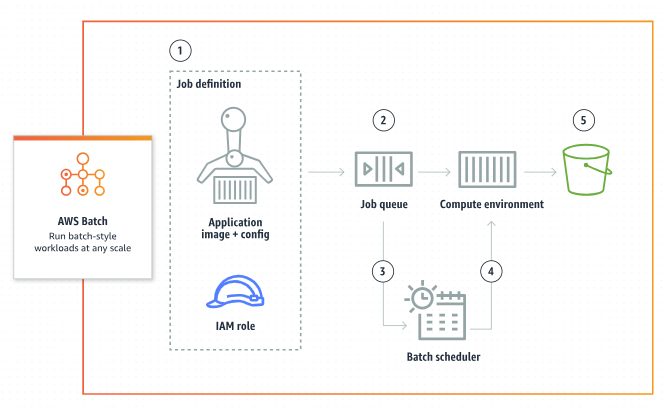

# aws docker entry point



## setup docker images
### Build
```
docker compose -f docker-compose.yml build #Building estimated time

# docker images
#REPOSITORY   TAG               IMAGE ID       CREATED         SIZE
#awsbatch     latest            811d5b0b07f9   2 minutes ago   452MB
```

### Stop container and remove it
```
bash ../stop_container_and_removeit.bash
```

## aws
```
AWS_PROFILE=AWSAdministratorAccess-cdi-dev
bash ../../docs/aws-services/aws-login.bash ${AWS_PROFILE}
#aws sso logout 
```

### Create job defiction [:link:](https://eu-west-2.console.aws.amazon.com/batch/home?region=eu-west-2#job-definition/ec2/new) 
Generating [registerjob.yaml](configs/registerjob.yaml)
```
REPOSITORY_NAME="cdi-hub/test-container" 
AWS_REGION=eu-west-2 
aws ecr create-repository --repository-name ${REPOSITORY_NAME} --region $AWS_REGION --profile ${AWS_PROFILE} #private by default
```

### Build and Upload container to the ECR [:link:](https://docs.aws.amazon.com/AmazonECR/latest/userguide/docker-push-ecr-image.html)
```
#cd Docker image location
IMAGE_ID=`aws ecr describe-repositories --repository-names ${REPOSITORY_NAME} --output text --query 'repositories[0].[repositoryUri]' --region $AWS_REGION --profile ${AWS_PROFILE}` 
docker build -t ${IMAGE_ID}:latest . 
aws ecr get-login-password --region ${AWS_REGION} --profile ${AWS_PROFILE} | docker login --username AWS --password-stdin "${IMAGE_ID}"  
docker push ${IMAGE_ID}:latest 
```


## Blurs
### Launch and test image
```
docker run --name awsbatch_container --detach awsbatch:latest
docker exec -it awsbatch_container bash
```


