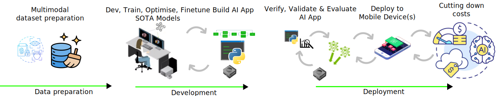

# End-to-End AI Workflow for Automated Multimodal Medical Image Reporting (AMMIR)



AMMIR is a python project designed as a template to benchmark end-to-end AI workflows, covering aspects such as model development, testing, training, and evaluation across both local and cloud platforms like Amazon Web Services. It also incorporates best software practices, aiming to align with medical software standards (ISO 62304).

## :nut_and_bolt: Installation
### :wrench: Local development installation
```
uv venv --python 3.12 # Create a virtual environment at .venv.
source .venv/bin/activate #To activate the virtual environment
uv pip install -e ".[test,learning]" # Install the package in editable mode
uv pip list --verbose #check versions
pre-commit run -a #pre-commit hooks
```
See further details for installation [here](docs).

### :recycle: Model development 
Script to perform [unit_test_simple_ml_pipeline](scripts/unit_test_ml_pipeline.bash) based on [test_ml_pipeline](tests/test_ml_pipeline.py)
```
bash scripts/unit_test_ml_pipeline.bash
```

## Content   

<details>
  <summary> Summary </summary>
Medical image interpretation and diagnosis depend on trained radiologists, involving the reasoning of visual features combined with prior knowledge [1]. However, this labor-intensive process often results in delays and potential misdiagnoses, underscoring the challenge of meeting the growing demand for expert interpretation. To address this, the emerging field of Automatic Medical Image Reporting (AMIR) integrates computer vision (CV) and natural language processing (NLP) to streamline and enhance the process.
Automated medical image interpretation, capable of generating human-like reports, can significantly alleviate this burden by expediting diagnoses, particularly in situations where experts are unavailable.
However, real-world challenges remain, including model implementation, training, testing, and evaluation.
To ensure safe and effective use in clinical settings, model outputs must undergo rigorous evaluation and meet established standards.
</details>

<details>
  <summary> Local and AWS setup </summary>

* [local-setup](docs/)
* [AWS-setup](../aws-services/)

</details>


<details>
  <summary> Data request requirements </summary>
This project require access to MIMIC-CXR-JPG (~500 GB), chest radiographs with structured labels, containing 377,110 JPG format images and structured labels derived from the 227,827 free-text radiology reports associated with these images [4, 4.1, 4.2, 4.3].
MIMIC-CXR dataset (~5 TB) which is dicom-based dataset which includes 377,110 images corresponding to 227,835 radiographic studies performed at the Beth Israel Deaconess Medical Center in Boston, MA. [5, 5.1]. 
We recommend registering on PhysioNet to gain access to the datasets. Please note that you must become a credentialed user on [PhysioNet](https://mimic.mit.edu/docs/gettingstarted/#physionet-credentialing) which might take several business days. 
In the event of delays in account approvals or limited hard drive space, we can use open access chest X-ray collection from Indiana University, including: 7470 normalized images (14.19 GB), indiana_projections.csv(289.4 kB), indiana_reports.csv(1.68 MB) [6, 6.1]. See further details [here](data).
</details>


<details>
  <summary> Data preparation and cleaning </summary>
You might like to use [mimic-cxr-jpg-loader](https://github.com/filipepcampos/mimic-cxr-jpg-loader) to load the MIMIC-CXR-JPG Dataset which will also be useful to prepare mimic-cxr-reports.tar.gz. See further details [here](data).
</details>

<details>
  <summary> Software requirements and dependencies </summary>
A laptop with a Python [virtual environment configured](https://github.com/astral-sh/uv), including the following libraries: Pandas, PyDicom, and PyTorch.
Additional Python-based libraries that can be used include: [mimic-cxr-jpg-loader](https://github.com/filipepcampos/mimic-cxr-jpg-loader).
**NOTE:** Here are some [notebooks](https://github.com/budai4medtech/amir/tree/main/amir/models) that serve as a great starting point for preparing model fine-tuning and evaluation.   
</details>


<details>
  <summary> Model training and model evaluation </summary>
Train and evaluate Medical Transformer for Chest X-ray Diagnosis and Reporting [7-9].
Evaluation tools for image captioning can include BLEU, ROUGE-L, CIDEr, METEOR, SPICE scores [10].
</details>

<details>
  <summary> Hardware and infrastructure specifications </summary>
  * For laptops without a GPU, consider using Google Colab's free service as an alternative.
    Change runtime by going to `Edit` > `Notebook settings` > `T4 GPU`, resulting in:
    Tesla T4 GPU RAM (TPU) with 15.0 GB memory. System: RAM 12.7 GB. Disk: 112.6GB. 
    See details using `!nvidia-smi`. **NOTE** "In the version of Colab that is free of charge notebooks can run for at most 12 hours, depending on availability and your usage patterns." [source](https://research.google.com/colaboratory/faq.html#idle-timeouts)
  * For laptops equipped with a GPU and CUDA drivers:
    * Ensure you have sufficient hard drive space to store data and models.
    * Confirm that your GPU has the necessary CUDA drivers install
</details>


<details>
  <summary> (optional) Interface development </summary>
We recommend developing a Python-based interface using either [Streamlit](https://streamlit.io/) for a web-based solution or a simple command-line interface with [Click](https://click.palletsprojects.com/en/8.1.x/) or another suitable tool [12].
</details>

<details>
  <summary>Click to see references</summary>

1. Guo, Li, Anas M. Tahir, Dong Zhang, Z. Jane Wang, and Rabab K. Ward. "Automatic Medical Report Generation: Methods and Applications." APSIPA Transactions on Signal and Information Processing 13, no. 1 (2024). [DOI](10.1561/116.20240044) [arxiv](https://arxiv.org/abs/2408.13988)

2. Hou, Benjamin, Georgios Kaissis, Ronald M. Summers, and Bernhard Kainz. "Ratchet: Medical transformer for chest x-ray diagnosis and reporting." In Medical Image Computing and Computer Assisted Intervention–MICCAI 2021: 24th International Conference, Strasbourg, France, September 27–October 1, 2021, Proceedings, Part VII 24, pp. 293-303. Springer International Publishing, 2021.  [arxiv](https://arxiv.org/pdf/2107.02104) [google-citations](https://scholar.google.com/scholar?cites=6324608147072853701&as_sdt=2005&sciodt=0,5&hl=en)

3. Ramesh, Vignav, Nathan A. Chi, and Pranav Rajpurkar. "Improving radiology report generation systems by removing hallucinated references to non-existent priors." In Machine Learning for Health, pp. 456-473. PMLR, 2022. [arxiv](https://arxiv.org/abs/2210.06340) [github-repo](https://github.com/rajpurkarlab/CXR-ReDonE) [google-scholar](https://scholar.google.com/scholar?cites=4808802074430489275&as_sdt=2005&sciodt=0,5&hl=en)

4. https://physionet.org/content/mimic-cxr-jpg/2.1.0/   

4.1. https://github.com/filipepcampos/mimic-cxr-jpg-loader

4.2. "Training a Convolutional Neural Network to Classify Chest X-rays" https://github.com/MIT-LCP/2019-hst-953/blob/master/tutorials/mimic-cxr/mimic-cxr-train.ipynb

4.3. "Predict plueral effusion in chest x-rays using the MIMIC-CXR-JPG dataset" https://github.com/dalton-macs/pleural-effusion-cnn/tree/main/data

5. https://physionet.org/content/mimic-cxr/2.1.0/     

5.1 https://mimic.mit.edu/docs/iv/modules/cxr/ 

6. https://www.kaggle.com/datasets/raddar/chest-xrays-indiana-university     

6.1 https://www.kaggle.com/datasets/raddar/chest-xrays-indiana-university/code

7.  https://github.com/omar-mohamed/X-Ray-Report-Generation/    

8. https://doi.org/10.1016/j.imu.2021.100557    

9. https://github.com/farrell236/RATCHET   

10. https://github.com/Aldenhovel/bleu-rouge-meteor-cider-spice-eval4imagecaption 

11. https://aws.amazon.com/blogs/machine-learning/automatically-generate-impressions-from-findings-in-radiology-reports-using-generative-ai-on-aws/

12. https://github.com/aws-samples/llm-radiology-reports

</details>

