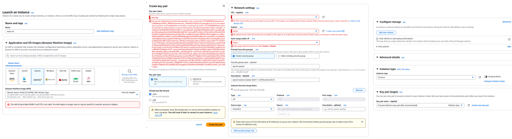

# Setting up AWS

## Intro
A common approach to working with AWS involves first creating resources manually through the AWS Management Console for experimentation and validation. 
Once the setup is understood and tested, the process is automated using AWS CLI or Infrastructure as Code (IaC) tools such as CloudFormation, AWS CDK, or Terraform.
It’s fairly common to use a simple Bash script containing AWS CLI commands to provision infrastructure.
The true power of cloud computing lies in its "on-demand" nature, enabling you to easily create and delete resources as needed. 
This approach aligns with the philosophy of ["treating your servers like cattle, not pets"](https://devops.stackexchange.com/questions/653/what-is-the-definition-of-cattle-not-pets), focusing on scalability and disposability rather than individual care and maintenance.

## Access to UCL cloud
1. Request AWS access to CDI team
2. Open AWS access portal: https://ucl-cloud.awsapps.com/start#/

## Accounts in the AWS access portal
* The best account would be the 'arc-playpen-collaborations'. It designed to do experiments and cleaned up from time to time. So it safe to create and delete resources. However, there might be a limitation on what kind of AWS you can create.
* The "cdi-innov-dev" and "cdi-innov-prod" accounts are managed by us, so it's important to tag the resources properly so we can clear them up. These are for "real" application that we are going to use for CDI e.g. Innovation environment.
* `cdi-innov-dev` can also be used for experiments if arc-playpen-collaborations doesn't allow to create something. It's important to tag the AWS resources, so we can delete them later. E.g. name tag "igor-experiments-sagemaker-to-delete"

## Launch an instance
1. Installing or updating to the latest version of the AWS CLI under Ubuntu
```
sudo snap install aws-cli --classic
```
2. aws configure
```
AWS Access Key ID [None]: :warning: "Where to find it?"
AWS Secret Access Key [None]: :warning:  "Where to find it?"
Default region name [None]: :warning:  "Where to find it?"
Default output format [None]: :warning:  "Where to find it?"
```
3. Open the Amazon EC2 console at https://console.aws.amazon.com/ec2/   
* [ ] :warning: "The AMI ID (ami-08eb150f611ca277f) is not valid. The AMI might no longer exist or may be specific to another account or Region."
* [ ] :warning:  Create key pair: "You are not authorized to perform this operation."
* [ ] :warning:  "No VPCs found, either this account doesn’t have any VPCs in this region or an invalid search has been entered. "
* [ ] :warning:  "No subnets found, either this account has no subnets in this region or an invalid search has been entered"
* [ ] :warning: "Auto assign public IP must be set. Select Enable or Disable."


4. To create a Spot Instance request using run-instances
```
aws ec2 run-instances \
    --image-id ami-0abcdef1234567890 \
    --instance-type t2.micro \
    --count 5 \
    --subnet-id subnet-08fc749671b2d077c \
    --key-name MyKeyPair \
    --security-group-ids sg-0b0384b66d7d692f9 \
    --instance-market-options file://spot-options.json
```

## References
* Launch an Ubuntu EC2 instance using the AWS CLI: https://documentation.ubuntu.com/aws/en/latest/aws-how-to/instances/launch-ubuntu-ec2-instance/
* Create a Spot Instance request: https://docs.aws.amazon.com/AWSEC2/latest/UserGuide/spot-requests.html


