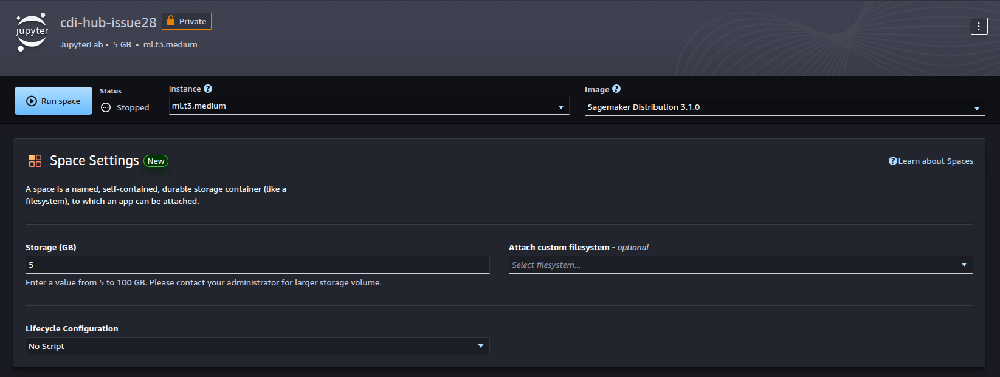

# Deploying and fine-tuning models on AWS

## Managing Amazon SageMaker AI
1. Amazon SageMaker AI, creating QuickSetupDomain-20250605T020811
2. User profiles. Launch Studio
3. Jupiter Lab


Terminate and delete services
1. Space: cdi-hub-issue28. Delete app.
2. User Details: default-20250605T020811. Delete User
3. Domain: QuickSetupDomain-20250605T020811. Delete domain


## Quota
```
ResourceLimitExceeded: An error occurred (ResourceLimitExceeded) when calling the CreateEndpoint operation: The 
account-level service limit 'ml.g6.48xlarge for endpoint usage' is 0 Instances, with current utilization of 0 
Instances and a request delta of 1 Instances. Please use AWS Service Quotas to request an increase for this quota. 
If AWS Service Quotas is not available, contact AWS support to request an increase for this quota.
```

## References
https://huggingface.co/blog/deepseek-r1-aws 
https://github.com/aws/sagemaker-huggingface-inference-toolkit/