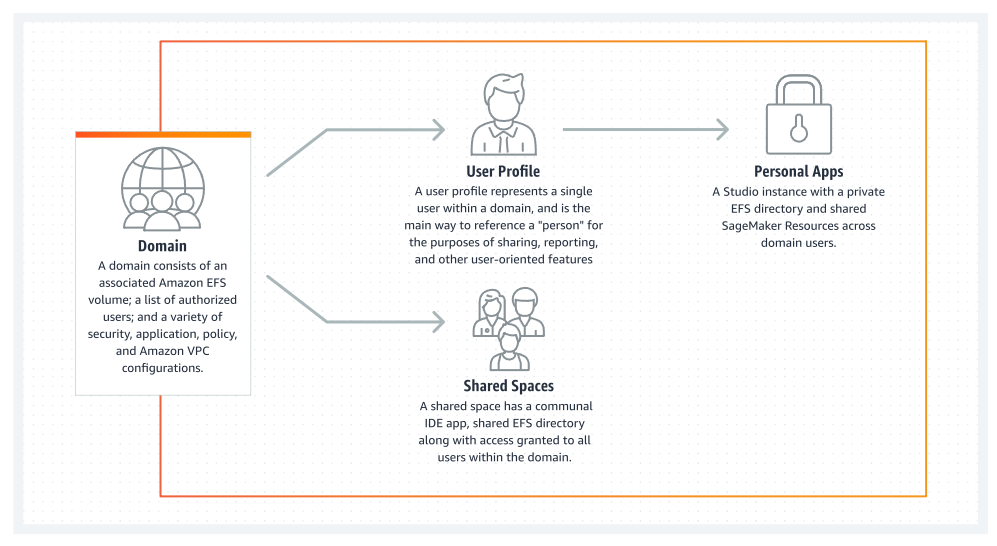
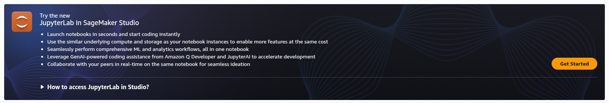
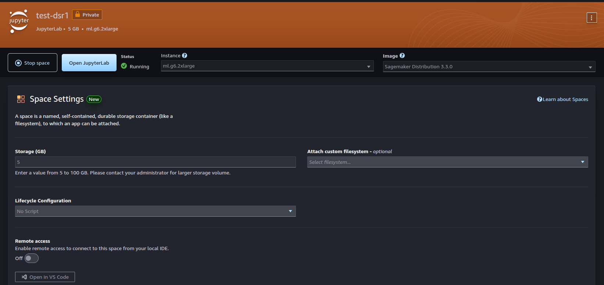
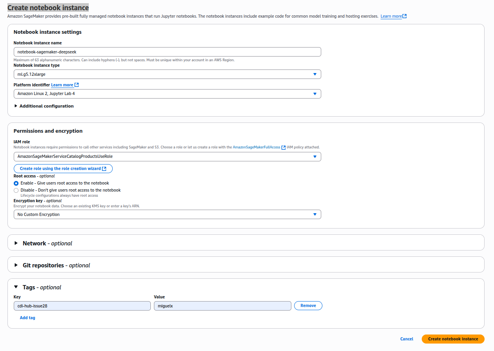

# Deploying and fine-tuning models on AWS

> A running document to showcase how to deploy and fine-tune DeepSeek R1 models with Hugging Face on AWS.
[ref](https://huggingface.co/blog/deepseek-r1-aws); [ref](https://aws.amazon.com/blogs/machine-learning/deploy-deepseek-r1-distilled-models-on-amazon-sagemaker-using-a-large-model-inference-container/)


## Domains, user profile and space management 
Amazon SageMaker AI now supports the creation of multiple SageMaker AI domains in a single AWS Region for each account. Each domain can have its own domain settings, such as authentication mode, and networking settings, such as VPC and subnets. A user profile cannot be shared across domains.



## Editing notebook locally
* Install jupyter with uv
```
uv run --with jupyter jupyter lab
```
* Edit notebook in the browser


## Open AWS access portal

1. Go to https://ucl-cloud.awsapps.com/start#/
2. Select account and click AWSAdministratorAccess


## Managing Amazon SageMaker AI
0. Go to Notebooks and Git Repos; and `Get Started` to create QuickSetupDomain
1. Set up for single user (Quick setup)


2. Amazon SageMaker AI, creating QuickSetupDomain-${DATE_AND_TIME}
> Perfect for single user domains and first time users looking to get started with SageMaker. Let Amazon SageMaker configure your account, and set up permissions for your SageMaker Domain.
* New IAM role with AmazonSageMakerFullAccess policy
* Public internet access, and standard encryption
* SageMaker Studio - New, and SageMaker Studio Classic integrations
* Sharable SageMaker Studio Notebooks
* SageMaker Canvas
* IAM Authentication

2. User profiles. Launch Studio

3. Jupiter Lab
    * Seeting up with Instance Type
        * INSTANCE_TYPE = "ml.t3.medium"
            Default
            Standard Instances: ml.t3.medium;	vCPU:2;	Memory: 4 GiB;	Price per Hour: $0.05 #https://aws.amazon.com/sagemaker/ai/pricing/


        * INSTANCE_TYPE = "ml.g6.2xlarge"
            The g6.2xlarge instance is in the GPU instance family with 8 vCPUs, 32 GiB of memory and up to 10 Gibps of bandwidth starting at $0.9776 per hour.
            https://instances.vantage.sh/aws/ec2/g6.2xlarge?currency=USD

        * INSTANCE_TYPE = "ml.g5.2xlarge" 
            The g5.2xlarge instance is in the GPU instance family with 8 vCPUs, 32 GiB of memory and up to 10 Gibps of bandwidth starting at $1.212 per hour.
            https://instances.vantage.sh/aws/ec2/g5.2xlarge?currency=USD
            https://aws.amazon.com/blogs/machine-learning/deploy-deepseek-r1-distilled-models-on-amazon-sagemaker-using-a-large-model-inference-container/

        * INSTANCE_TYPE = "ml.g5.12xlarge"
            The g5. 12xlarge instance is in the GPU instance family with 48 vCPUs, 192 GiB of memory and 40 Gibps of bandwidth starting at $5.672 per hour.
            https://instances.vantage.sh/aws/ec2/g5.12xlarge?currency=USD


## AWS sagemaker CLI
* Clone repo
```
git clone https://github.com/UCL-CDI/cdi-hub.git
git checkout 28-deploying-finetunning-DeepSeek-model-in-aws
```

* aws sagemaker 
```
$ aws sagemaker list-endpoint-configs
{
    "EndpointConfigs": [
        {
            "EndpointConfigName": "deepseek-llm-r1-distill-qwen-1-5b-ep",
            "EndpointConfigArn": "arn:aws:sagemaker:eu-:endpoint-config/deepseek-llm-r1-distill-qwen-1-5b-ep",
            "CreationTime": ""
        }
    ]
}

$aws sagemaker delete-endpoint-config  --endpoint-config-name  deepseek-llm-r1-distill-qwen-1-5b-ep

$ aws sagemaker list-endpoint-configs
{
    "EndpointConfigs": []
}
```



## Terminate and delete services using console 
1. Stop Space: cdi-hub-issue28. Delete app.
2. User Details: default-20250605T020811. Delete User
3. Domain: QuickSetupDomain-20250605T020811. Delete domain

## Delete an Amazon SageMaker AI domain (AWS CLI)
* Connect (click approve) to login
```bash
bash ../aws-services/scripts/aws-config-login.bash
```
* cleanup-sagemaker.bash
```bash
bash ../aws-services/scripts/cleanup-sagemaker.bash
```

* Delete bucket
```
#todo: aws 
```


## Clean and delete resources

* Open the Amazon S3 console at https://console.aws.amazon.com/s3/, and then delete the bucket that you created for storing model artifacts and the training dataset.
* Open the Amazon CloudWatch console at https://console.aws.amazon.com/cloudwatch/, and then delete all of the log groups that have names starting with /aws/sagemaker/.


## License
This [code repository] and the model weights](https://eu-west-2.console.aws.amazon.com/bedrock/home?region=eu-west-2#/model-catalog/bedrock-marketplace/deepseek-llm-r1-distill-qwen-1-5b) are licensed under the MIT License. DeepSeek-R1 series support commercial use, allow for any modifications and derivative works, including, but not limited to, distillation for training other LLMs. Please note that:

DeepSeek-R1-Distill-Qwen-1.5B, DeepSeek-R1-Distill-Qwen-7B, DeepSeek-R1-Distill-Qwen-14B and DeepSeek-R1-Distill-Qwen-32B are derived from Qwen-2.5 series , which are originally licensed under Apache 2.0 License , and now finetuned with 800k samples curated with DeepSeek-R1.
DeepSeek-R1-Distill-Llama-8B is derived from Llama3.1-8B-Base and is originally licensed under llama3.1 license .
DeepSeek-R1-Distill-Llama-70B is derived from Llama3.3-70B-Instruct and is originally licensed under llama3.3 license .


## Known Issues
* Quota
```
ResourceLimitExceeded: An error occurred (ResourceLimitExceeded) when calling the CreateEndpoint operation: The 
account-level service limit 'ml.g6.48xlarge for endpoint usage' is 0 Instances, with current utilization of 0 
Instances and a request delta of 1 Instances. Please use AWS Service Quotas to request an increase for this quota. 
If AWS Service Quotas is not available, contact AWS support to request an increase for this quota.
```


## Create notebook instance




## References
* https://huggingface.co/blog/deepseek-r1-aws
* https://github.com/aws/sagemaker-huggingface-inference-toolkit
* https://github.com/aws/sagemaker-python-sdk
* https://repost.aws/knowledge-center/sagemaker-resource-utilization
* https://aws.amazon.com/blogs/machine-learning/deploy-deepseek-r1-distilled-models-on-amazon-sagemaker-using-a-large-model-inference-container/