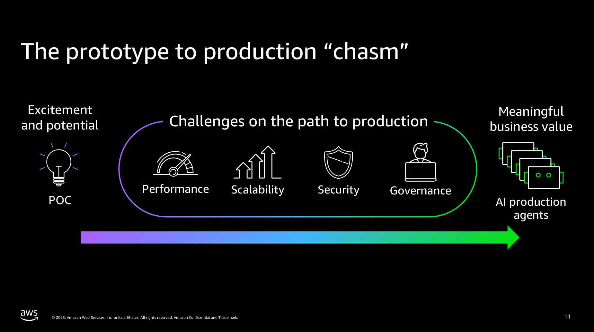
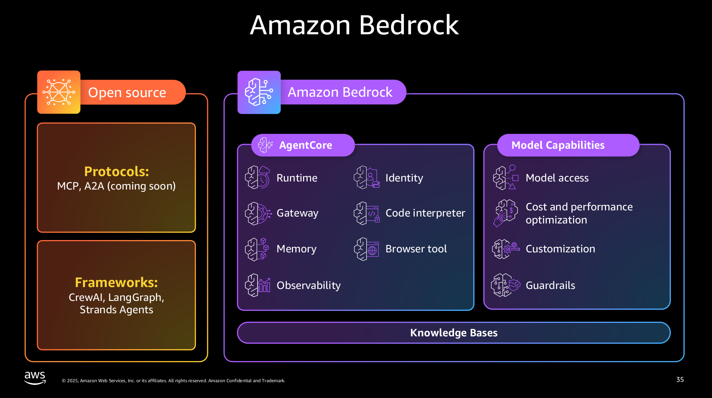

# UCL-CDI Workshop - Building Intelligent AI Agents with AWS [22 Sept 2025] 

## Instructors
* Dr Anil Kumar Giri, AWS Solutions Architect | ISV & GenAI Solutions
* Russell Bennett

## Introduction
Learn to build and orchestrate AI agents using AWS technologies in this hands-on workshop. Master the Model Context Protocol and Strands SDK while creating various agent types - from simple calculators to complex multi-agent systems with memory, knowledge bases, and dynamic tool creation capabilities. This workshop guides developers through seven comprehensive modules, each focusing on different aspects of AI agent development. You'll start with basic MCP implementations and progress to sophisticated multi-agent architectures.

## Workshop objectives
* Deploy secure, scalable AI agents using AgentCore Runtime
* Implement robust authentication and authorization with AgentCore Identity
* Integrate external services through AgentCore Gateway
* Extend agent capabilities using AgentCore Tools
* Manage agent memory and context with AgentCore Memory
* Monitor agent performance with AgentCore Observability

## Prerequisites
* Basic understanding of AWS Services
* Fundamental ML concepts
* Basic Python programming knowledge
* Laptop with internet connection

## Agenda:
10:00 – 10:10 - Welcome & Introductions  
10:10 – 11:10 - Overview of Agentic AI on AWS  
11:10 – 11:20 - Break  
11:20 – 12:00 - Workshop (Diving Deep into Bedrock AgentCore)  
12:00 - 13:00 - Lunch  
13:00 – 13:50 - Workshop continued (Diving Deep into Bedrock AgentCore)  
13:50 - 14:00 - Close, Summary, Survey  


## Notes

* The material is publicly available at:
https://catalog.workshops.aws/agentcore-deep-dive/en-US

* The code and documentation are available at:
https://github.com/awslabs/amazon-bedrock-agentcore-samples/tree/1cf3c80c6d4e9cd1c65153aaca195053e8624b07/01-tutorials


* The section on the prototype-to-production ‘chasm’ illustrates the journey from initial excitement and potential (POC) to delivering meaningful business value, while highlighting key challenges in performance, stability, security, and governance.



* The figure clearly illustrates today’s workshop focus on AgentCore, while also highlighting other important elements such as open-source protocols, frameworks, model capabilities, and knowledge bases.



* The workshop runs on SageMaker Studio for 12 hours and is only available for these models.
```
* "arn:aws:bedrock:us-west-2::foundation-model/amazon.nova-premier",
* "arn:aws:bedrock:us-west-2::foundation-model/amazon.nova-pro",
* "arn:aws:bedrock:us-west-2::foundation-model/amazon.titan-embed-text-v1",
* "arn:aws:bedrock:us-west-2::foundation-model/amazon.titan-embed-text-v2:0",
* "arn:aws:bedrock:us-west-2::foundation-model/anthropic.claude-3-5-haiku-20241022-v1:0",
* "arn:aws:bedrock:us-west-2::foundation-model/anthropic.claude-3-5-sonnet-20241022-v2:0",
* "arn:aws:bedrock:us-west-2::foundation-model/anthropic.claude-3-7-sonnet-20250219-v1:0"
```

## Fleshing out content

The actual content of the workhshop is based in [this public repository](https://github.com/awslabs/amazon-bedrock-agentcore-samples) and below a tree-based illustrate more in detail the componets of AgentCore.


* [01-agent-core-runtime](bedrock-agent-core-service/01-agent-core-runtime/)
```
├── 01-hosting-agent
│   ├── 01-strands-with-bedrock-model
│   ├── 02-langgraph-with-bedrock-model
│   ├── 03-strands-with-openai-model
│   ├── 04-crewai-with-bedrock-model
│   │   └── research_crew
├── 02-hosting-MCP-server
├── 03-advanced-concepts
│   ├── 01-streaming-agent-response
│   ├── 02-understanding-runtime-context
│   ├── 03-handling-large-payloads
│   ├── 04-async-agents
│   └── 05-multi-agents
│       └── 01-multi-runtimes-with-boto3
│           ├── hr_agent
│           ├── orchestrator_agent
│           └── tech_agent
├── 04-hosting-ts-MCP-server
```

* [02-agent-core-gateway](bedrock-agent-core-service/02-agent-core-gateway)
```
├── 01-transform-lambda-into-mcp-tools
├── 02-transform-apis-into-mcp-tools
│   ├── 01-transform-openapi-into-mcp-tools
│   │   └── openapi-specs
│   ├── 02-transform-smithyapis-into-mcp-tools
│   │   └── smithy-specs
│   └── images
├── 03-search-tools
│   ├── calc
│   └── restaurant
```

* [03-agent-core-identity](bedrock-agent-core-service/03-agent-core-identity/)
```
├── 03-Inbound Auth example
├── 04-Outbound Auth example
├── 05-Outbound_Auth_3lo
├── 06-Outbound_Auth_Github
```

* [04-agent-core-memory](bedrock-agent-core-service/04-agent-core-memory/)
```
├── 01-short-term-memory
│   ├── 01-single-agent
│   │   ├── with-langgraph-agent
│   │   └── with-strands-agent
│   └── 02-multi-agent
│       └── with-strands-agent
├── 02-long-term-memory
│   ├── 01-single-agent
│   │   ├── using-strands-agent-hooks
│   │   │   ├── customer-support
│   │   │   └── simple-math-assistant
│   │   └── using-strands-agent-memory-tool
│   └── 02-multi-agent
│       └── with-strands-agent
├── 03-advanced-patterns
│   ├── 01-guardrails-integration
│   └── 02-memory-runtime-integration
```

* [05-agent-core-browser-tool](bedrock-agent-core-service/05-agent-core-browser-tool/)
```
├── 01-browser-with-NovaAct
├── 02-browser-with-browserUse
└── interactive_tools
    ├── live_view_sessionreplay
    └── static
        ├── css
        ├── dcvjs
        │   ├── dcv
        │   └── lib
        │       ├── broadway
        │       ├── jsmpeg
        │       └── lz4
        └── replay-viewer
```

* [06-agent-core-code-interpreter](bedrock-agent-core-service/06-agent-core-code-interpreter/)
```
├── 01-file-operations-using-code-interpreter
├── 02-code-execution-with-agent-using-code-interpreter
├── 03-advanced-data-analysis-with-agent-using-code-interpreter
├── 04-run-commands-using-code-interpreter
```

*  [07-agent-core-observability](bedrock-agent-core-service/07-agent-core-observability/)
```
├── 01-Agentcore-runtime-hosted
├── 02-Agent-not-hosted-on-runtime
│   ├── CrewAI
│   ├── Langgraph
│   └── Strands
└── 03-advanced-concepts
    └── 01-custom-span-creation
```


## Q&As

Q1. You talk about the prototype-to-production chasm and how to navigate from excitement and potential to meaningful business value, but I am missing a way to cost and monitor running end-to-end workshops. Are there any services or resources that can help with that?


* Pricing Table
Charger based ont service type:

https://aws.amazon.com/bedrock/agentcore/pricing/


## Some Feedback

* I would start giving the big picture of amazing bedrock, slide 11 and 35 look great.
* Adionanl to asking our epxerince with agents is good but it would be usuefl that you ask for the auditnece prefernce on where they are appyuing or wnat to use agents, so you undestand better the needs of the audence. 
* Thare some missing notebooks in the innovation sandbox compared to the ones in the repository.
```
├── 03-agent-core-identity
│   ├── 05-Outbound_Auth_3lo
│   ├── 06-Outbound_Auth_Github
and
├── 02-Agent-not-hosted-on-runtime
│   ├── CrewAI
│   ├── Langgraph
```


## Warnings and errors

* Runnnig notebooks create some error logs that does not stop the application be te run but perhaps creating environments or specifying versions of packages in the requirements would help. 

```
ERROR: pip's dependency resolver does not currently take into account all the packages that are installed. This behaviour is the source of the following dependency conflicts.
autogluon-multimodal 1.4.0 requires nvidia-ml-py3<8.0,>=7.352.0, which is not installed.
dash 2.18.1 requires dash-core-components==2.0.0, which is not installed.
dash 2.18.1 requires dash-html-components==2.0.0, which is not installed.
dash 2.18.1 requires dash-table==5.0.0, which is not installed.
jupyter-ai 2.31.6 requires faiss-cpu!=1.8.0.post0,<2.0.0,>=1.8.0, which is not installed.
aiobotocore 2.21.1 requires botocore<1.37.2,>=1.37.0, but you have botocore 1.40.35 which is incompatible.
autogluon-common 1.4.0 requires psutil<7.1.0,>=5.7.3, but you have psutil 7.1.0 which is incompatible.
autogluon-multimodal 1.4.0 requires jsonschema<4.24,>=4.18, but you have jsonschema 4.25.1 which is incompatible.
autogluon-multimodal 1.4.0 requires transformers[sentencepiece]<4.50,>=4.38.0, but you have transformers 4.55.2 which is incompatible.
autogluon-timeseries 1.4.0 requires transformers[sentencepiece]<4.50,>=4.38.0, but you have transformers 4.55.2 which is incompatible.
dash 2.18.1 requires Flask<3.1,>=1.0.4, but you have flask 3.1.1 which is incompatible.
dash 2.18.1 requires Werkzeug<3.1, but you have werkzeug 3.1.3 which is incompatible.
fastapi 0.116.1 requires starlette<0.48.0,>=0.40.0, but you have starlette 0.48.0 which is incompatible.
flake8 7.1.2 requires pycodestyle<2.13.0,>=2.12.0, but you have pycodestyle 2.14.0 which is incompatible.
jupyter-scheduler 2.11.0 requires psutil~=5.9, but you have psutil 7.1.0 which is incompatible.
mlflow 2.22.0 requires packaging<25, but you have packaging 25.0 which is incompatible.
mlflow-skinny 2.22.0 requires packaging<25, but you have packaging 25.0 which is incompatible.
sagemaker 2.245.0 requires attrs<24,>=23.1.0, but you have attrs 25.3.0 which is incompatible.
sagemaker 2.245.0 requires importlib-metadata<7.0,>=1.4.0, but you have importlib-metadata 8.6.1 which is incompatible.
sagemaker 2.245.0 requires packaging<25,>=23.0, but you have packaging 25.0 which is incompatible.
sagemaker-studio-analytics-extension 0.2.0 requires sparkmagic==0.22.0, but you have sparkmagic 0.21.0 which is incompatible.
sparkmagic 0.21.0 requires pandas<2.0.0,>=0.17.1, but you have pandas 2.3.1 which is incompatible.
thinc 8.3.6 requires numpy<3.0.0,>=2.0.0, but you have numpy 1.26.4 which is incompatible.
```


## References


* strandsagents
    * Build production-ready, multi-agent AI systems in a few lines of code
    * https://strandsagents.com/latest/


* Amazon Bedrock AgentCore Samples
    * This project is licensed under [the Apache License 2.0](https://github.com/awslabs/amazon-bedrock-agentcore-samples)
    * https://github.com/awslabs/amazon-bedrock-agentcore-samples


https://aws.amazon.com/marketplace
