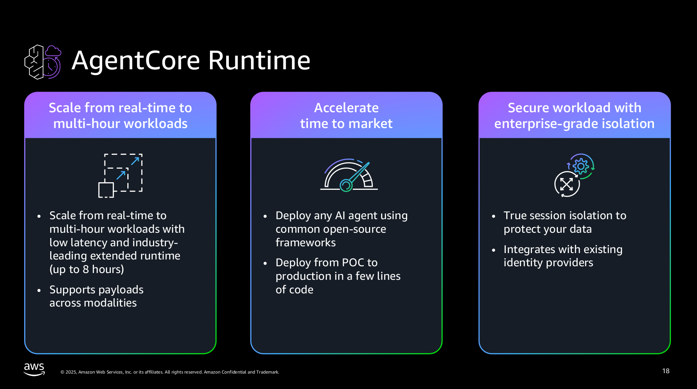
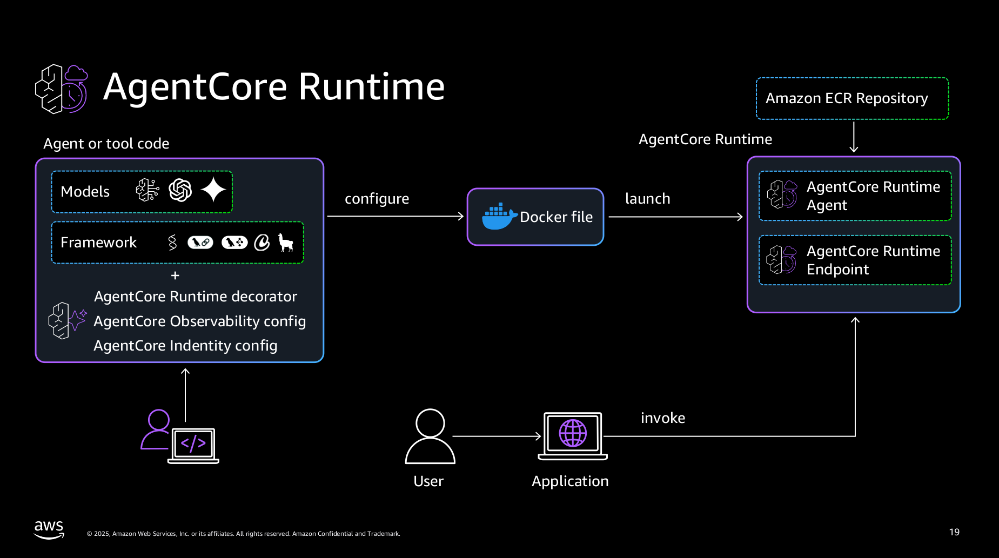

# Amazon Bedrock AgentCore Runtime

https://github.com/awslabs/amazon-bedrock-agentcore-samples/tree/main/01-tutorials/01-AgentCore-runtime






## Content
```
├── 01-hosting-agent
│   ├── 01-strands-with-bedrock-model
│   │   └── images
│   ├── 02-langgraph-with-bedrock-model
│   │   └── images
│   ├── 03-strands-with-openai-model
│   │   └── images
│   ├── 04-crewai-with-bedrock-model
│   │   ├── images
│   │   └── research_crew
│   └── images
├── 02-hosting-MCP-server
│   └── images
├── 03-advanced-concepts
│   ├── 01-streaming-agent-response
│   │   └── images
│   ├── 02-understanding-runtime-context
│   │   └── images
│   ├── 03-handling-large-payloads
│   ├── 04-async-agents
│   └── 05-multi-agents
│       └── 01-multi-runtimes-with-boto3
│           ├── hr_agent
│           ├── orchestrator_agent
│           └── tech_agent
├── 04-hosting-ts-MCP-server
│   └── src
```


