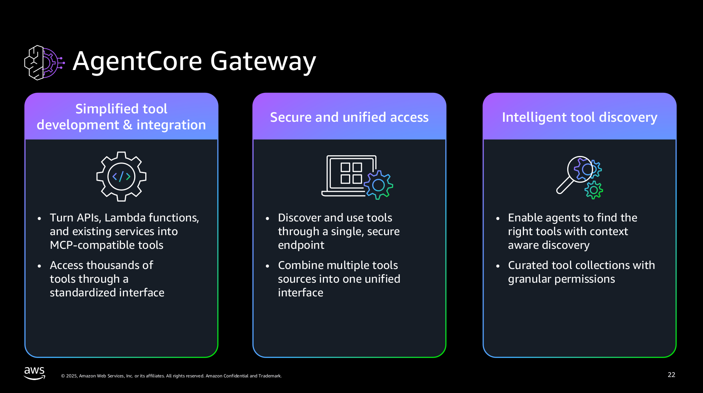
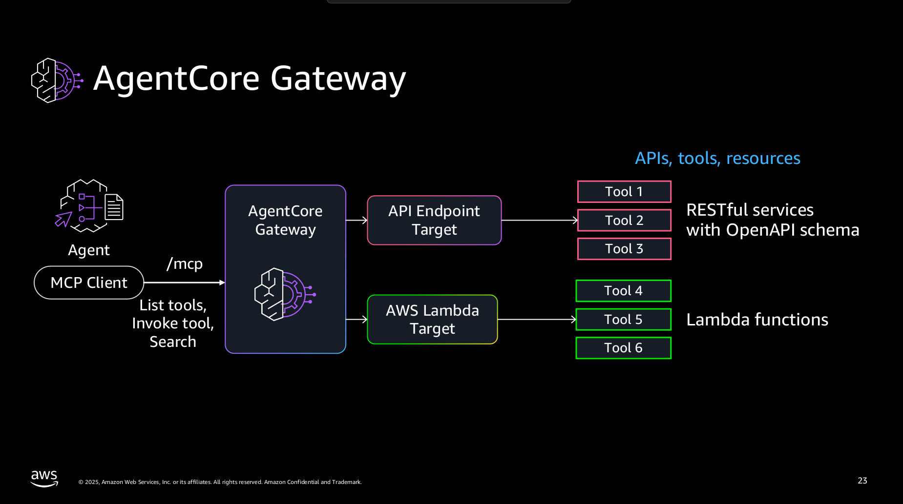
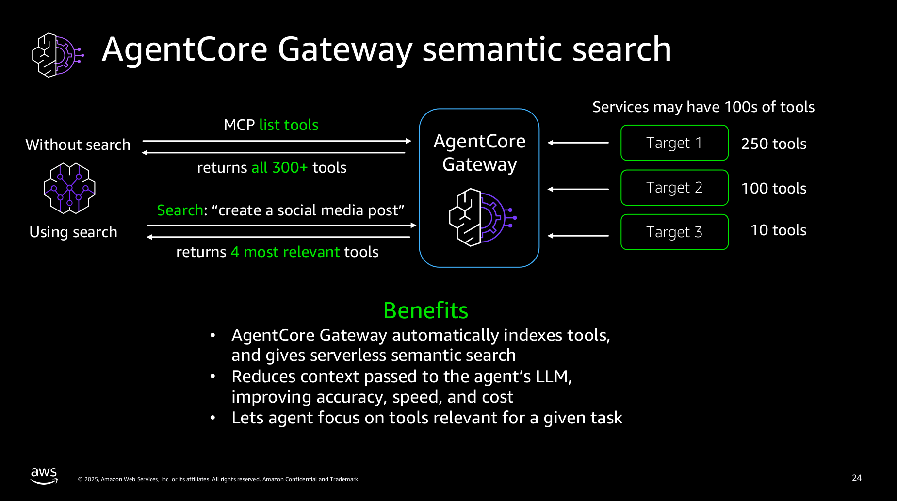

# Amazon Bedrock AgentCore Gateway
https://github.com/awslabs/amazon-bedrock-agentcore-samples/tree/main/01-tutorials/02-AgentCore-gateway





## Content
```
├── 01-transform-lambda-into-mcp-tools
│   └── images
├── 02-transform-apis-into-mcp-tools
│   ├── 01-transform-openapi-into-mcp-tools
│   │   ├── images
│   │   └── openapi-specs
│   ├── 02-transform-smithyapis-into-mcp-tools
│   │   ├── images
│   │   └── smithy-specs
│   └── images
├── 03-search-tools
│   ├── calc
│   ├── images
│   └── restaurant
```
