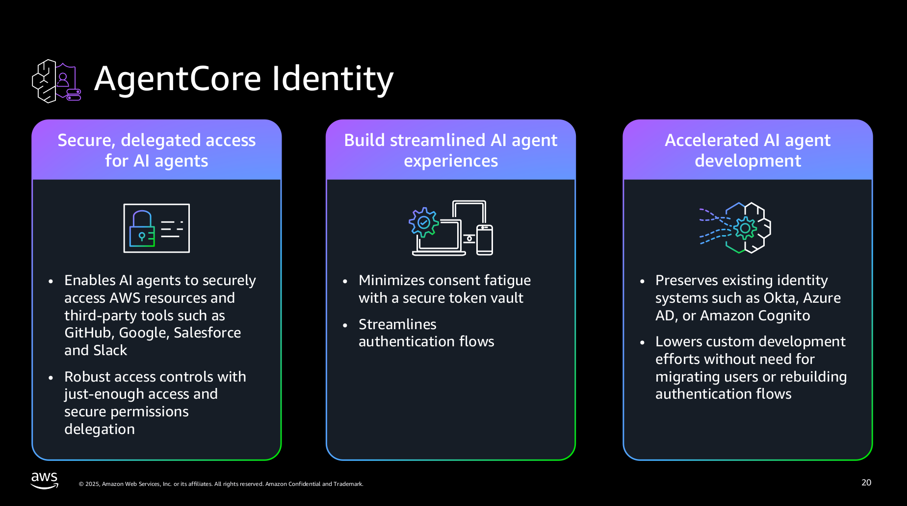
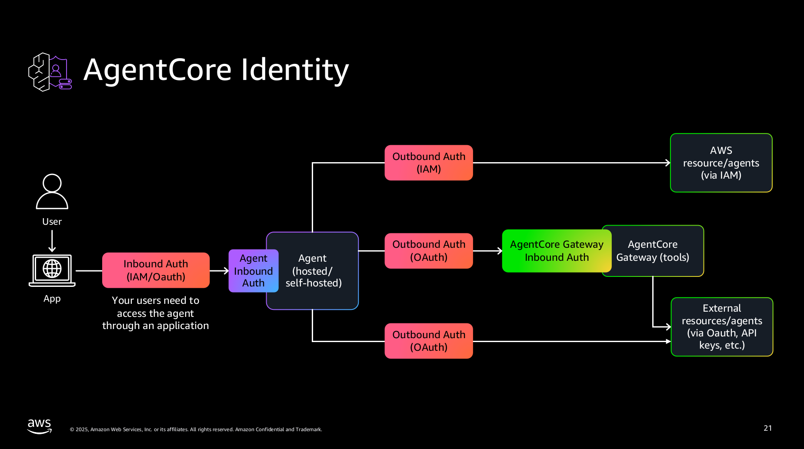

# AgentCore Identity

https://github.com/awslabs/amazon-bedrock-agentcore-samples/tree/main/01-tutorials/03-AgentCore-identity





## Content
```
.
├── 03-Inbound Auth example
│   └── images
├── 04-Outbound Auth example
│   └── images
├── 05-Outbound_Auth_3lo
│   └── images
├── 06-Outbound_Auth_Github
│   └── images
```


