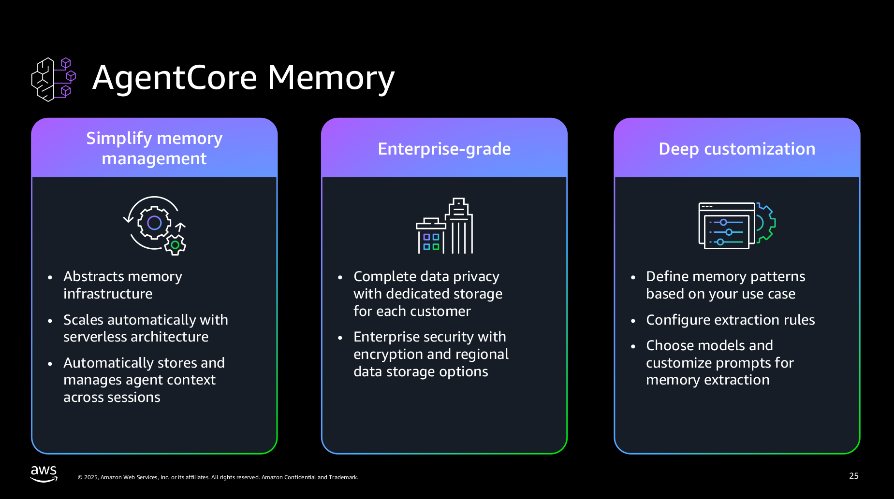
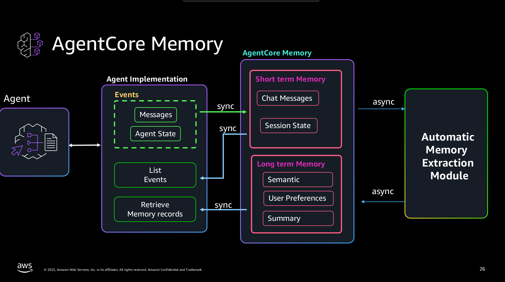

# Amazon Bedrock AgentCore Memory

https://github.com/awslabs/amazon-bedrock-agentcore-samples/tree/main/01-tutorials/04-AgentCore-memory





## Content
```
├── 01-short-term-memory
│   ├── 01-single-agent
│   │   ├── with-langgraph-agent
│   │   └── with-strands-agent
│   └── 02-multi-agent
│       └── with-strands-agent
├── 02-long-term-memory
│   ├── 01-single-agent
│   │   ├── using-strands-agent-hooks
│   │   │   ├── customer-support
│   │   │   └── simple-math-assistant
│   │   └── using-strands-agent-memory-tool
│   └── 02-multi-agent
│       └── with-strands-agent
├── 03-advanced-patterns
│   ├── 01-guardrails-integration
│   └── 02-memory-runtime-integration
```
