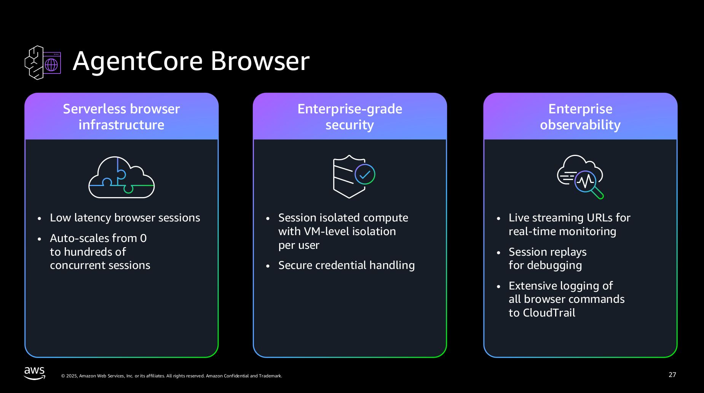
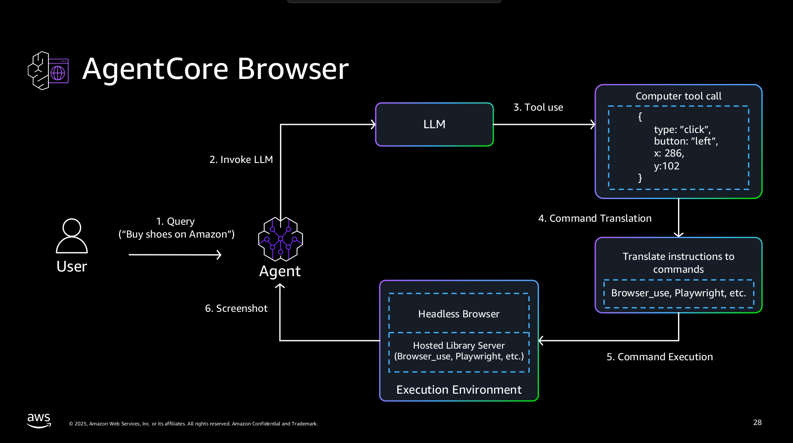

# Amazon Bedrock AgentCore Browser Tool
https://github.com/awslabs/amazon-bedrock-agentcore-samples/tree/main/01-tutorials/05-AgentCore-tools/02-Agent-Core-browser-tool




## Content
```
├── 01-browser-with-NovaAct
│   └── images
├── 02-browser-with-browserUse
│   └── images
├── images
└── interactive_tools
    ├── live_view_sessionreplay
    └── static
        ├── css
        ├── dcvjs
        │   ├── dcv
        │   └── lib
        │       ├── broadway
        │       ├── jsmpeg
        │       └── lz4
        └── replay-viewer
```
