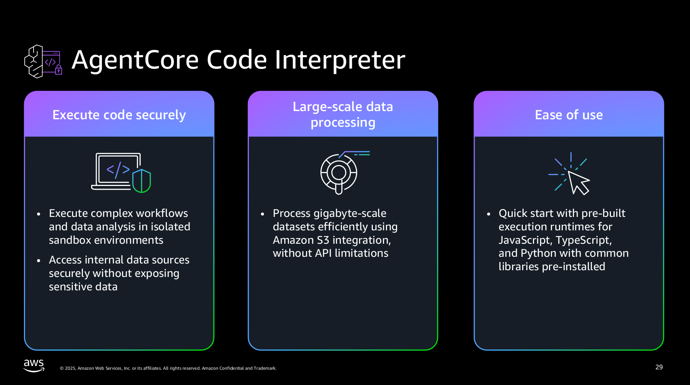
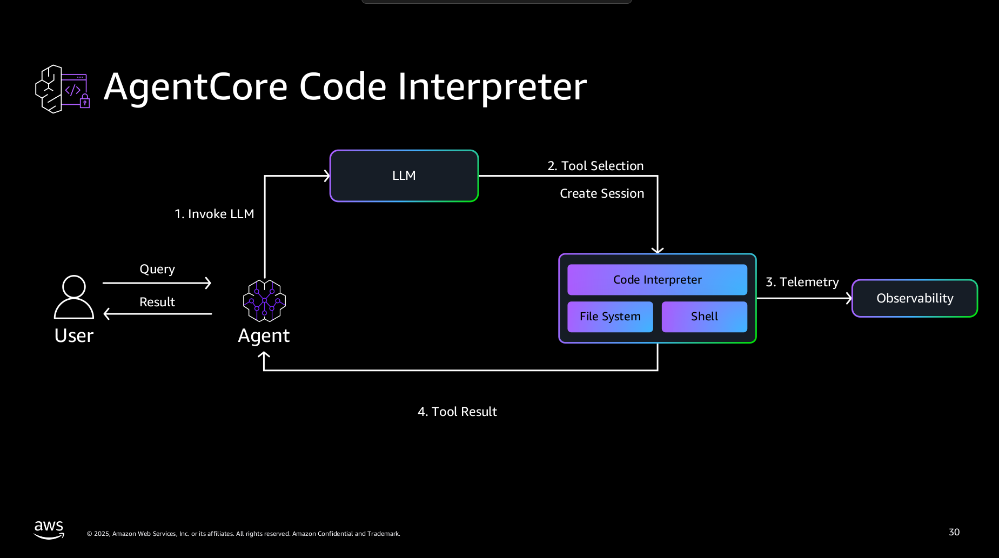

# Amazon Bedrock AgentCore RuntCode Interpreter

https://github.com/awslabs/amazon-bedrock-agentcore-samples/tree/1cf3c80c6d4e9cd1c65153aaca195053e8624b07/01-tutorials/05-AgentCore-tools/01-Agent-Core-code-interpreter





## Content
```
├── 01-file-operations-using-code-interpreter
│   └── samples
├── 02-code-execution-with-agent-using-code-interpreter
├── 03-advanced-data-analysis-with-agent-using-code-interpreter
│   └── samples
├── 04-run-commands-using-code-interpreter
│   └── samples
```
