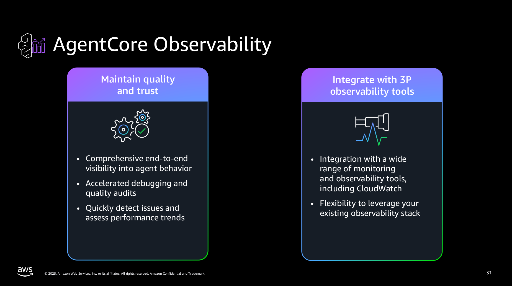
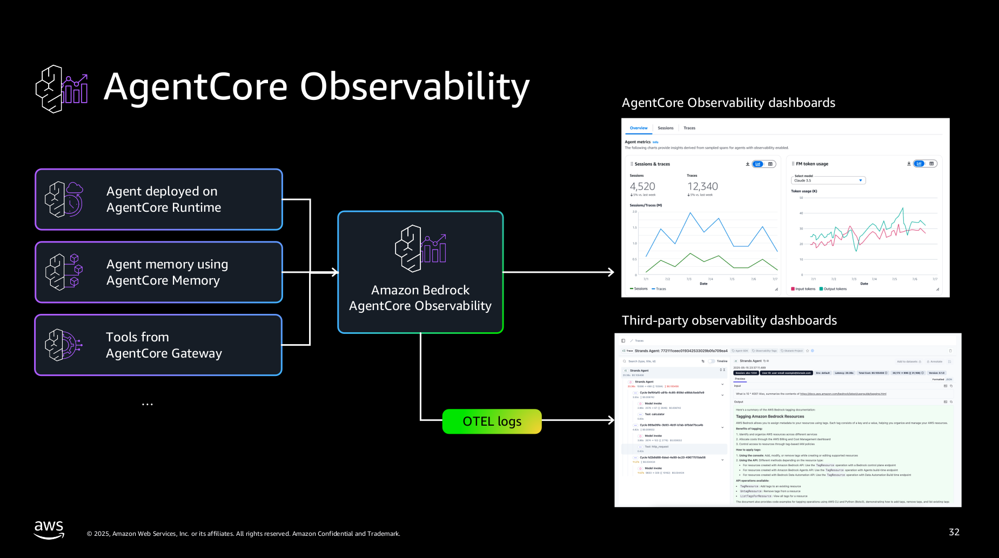

# AgentCore Observability on Amazon CloudWatch
https://github.com/awslabs/amazon-bedrock-agentcore-samples/tree/1cf3c80c6d4e9cd1c65153aaca195053e8624b07/01-tutorials/06-AgentCore-observability




## Content
```
├── 01-Agentcore-runtime-hosted
│   └── images
├── 02-Agent-not-hosted-on-runtime
│   ├── CrewAI
│   ├── Langgraph
│   └── Strands
│       └── images
└── 03-advanced-concepts
    └── 01-custom-span-creation
```


